# app_etl
 <br>

The objective of this solution is to implement an ETL application. <br>
The current implementation has these data sets(only 1 for now):
- data sets:
    - Malaria <br>
        - Why Malaria?: Malaria is disproportionately prevalent in Africa and it kills people. With proactive measure we could save lives.
        - WHO Malaria fact sheets: https://www.who.int/news-room/fact-sheets/detail/malaria

            - sub data sets:
                - Annual Malaria Confirmed Cases
                - Annual Malaria Presumed Cases: TODO: ETL yet to be implemented.
                - Annual Malaria Suspected Cases: TODO: ETL yet to be implemented.
        - Use cases:
            - track malaria cases annually, identify trends and take required actions:
                - if malaria cases are on the rise, countries could proactively:
                    - equip hospitals/clinics with more:
                        - malaria medicine
                        - malaria nets to give to patients
                        - staff hours
                    - public campaigns to remind citizenry of malaria and precautionary measures they can take.

            - plot suspected cases, presumed cases and confirmed together
                - if you see a convergence then take more measures
                    - vaccinate/prescribe medication to the presumed/suspected case

        - Potential customers:
            - RBC (Rwanda Biomedical Center)
            - Regions with Malaria (Africa, Middle East, Eastern Mediterranean)
                - public/private health institutions in these regions tracking Malaria.
## project layout
* api:
    the API to the applications lives in this module.
    the current implementation is REST API, but a gRPC, CLI API etc would be implemented in here.
* etl:
    each ETL implementation lives in this module and must implement the ETLInterface.
* gateway
    * all external interaction objects(e.g. files, external APIs etc) live in this module.
* migrations:
    * database migration scripts live in this location.
* repository:
    database interactions and abstractions live in this module.
        - code to query tables, execute stored procedures, schemas to group database objects etc
    NB: the database is considered a part of the application(i.e. its long term memory), hence these are not in `gateway`.
* app_flask.py:
    entry point to startup the application
## setup instructions
1. Install latest version of Docker for the Operating System you will run this on:
* Docker: https://docs.docker.com/get-docker/
```shell
./utilities/install_docker_mac.sh
```

2. clone repo:
```shell
git clone git@github.com:praisetompane/app_etl.git
```

3. start up docker
```shell
    # This one is MacOS specific
    # Linux and Windows will have their own
open -a Docker
```

4. build app image
```shell
    make build
```

# run program

1. to start system run:
```shell
    # this might take a while on the first run, please be patient.
    # it is because it downloading the images from Docker Hub if they are not on the machine.
./start_system.sh
```
- state changes:
    - database:
        - downloads the Postgres docker image
        - starts it up with configuration in `docker-compose.yaml`

    - application:
        - downloads base image used for application
        - adds the repository into image
        - builds a `app_etl:latest` Docker image
        - starts up `app_etl:latest with configuration in `docker-compose.yaml`

2. to stop the system run:
```shell
./stop_system.sh
```

# package management
- install pipenv: https://pypi.org/project/pipenv/
- to install packages into local environment:
```shell
pipenv install
```

# testing:
- to run tests:
```shell
pipenv shell
PYTHONPATH=src/ pytest
```
- with the system running:

# design
## database:

### state management:
- the database state (i.e. tables, stored procedures, indexes, etc) are managed using flyway.
    - flyway docs:  https://documentation.red-gate.com/fd/flyway-documentation-138346877.html
    - technical details for flyway configuration are in the docker-compose file, under `app_etl_db_flyway_migrations` service.
    - migrations location in repo: app_etl/migrations
    - migrations naming scheme: VYYYYMMDDHHSS
        - example: `V202310111851.sql`
    - current database state can be queried with `select * from flyway.flyway_schema_history`

### tables:
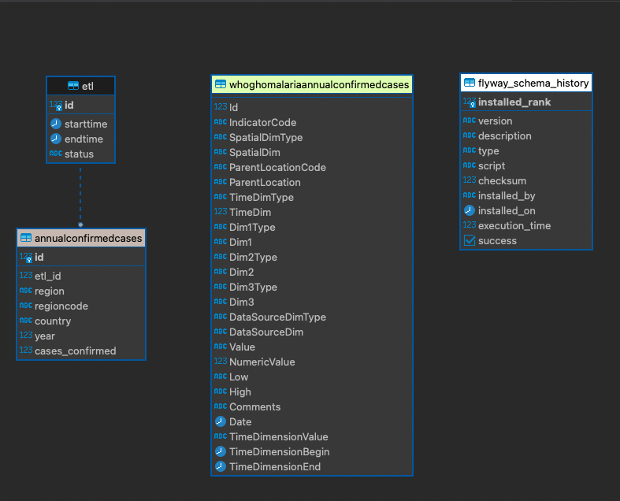
#### Source tables:
- save data in its original form.
    - benefits:
        - can run different transformation experiments without burden to source systems
        - can cancel E, and using a timestamp on the records, resume to load all data greater than oldest
            record.
            - depending on the size of the dataset, one can get it in chunks (quarterly, monthly, weekly, daily)
                or daily.
            - NB: you could just store last records timestamp on ETL record, but wouldn't have the first listed benefit.
        - audit: you have a record of the data used further into the pipeline.
                if the client changes it (for valid/invalid reasons) you can reason back
                to this original dataset used for the downstream processing(charts, ML, etc)
                to cross reference differences.
        - performance:
            - with the data in our control, we can create database indices, tuned query plans etc
                optimized for our pipeline's data usage patterns.

- naming conventions
    - must be `sourcedata.{source}_{table_name}`
    - example:
        - Malaria Annual Confirmed Cases from WHO GHO: `sourcedata.WHOGHOMalariaAnnualConfirmedCases`
#### Target tables:
- save transformed data in these tables.
- naming conventions
    - must be `{category}.{table_name}`
    - example:
        - Malaria Annual Confirmed Cases : `Malaria.AnnualConfirmedCases`


## Demo
### 0. build app_etl: <br>
- Terminal output: <br>
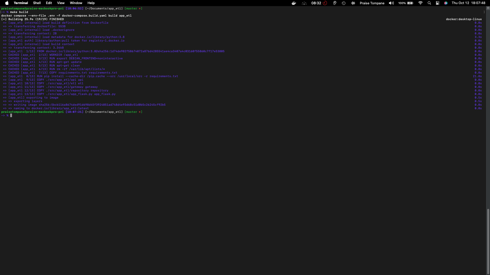

### 1. start system output: <br>
- Terminal output first run: <br>
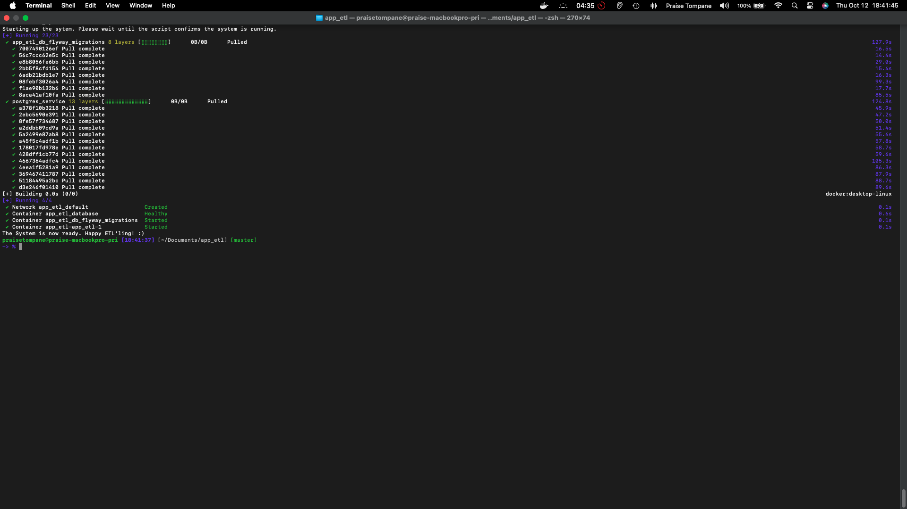
- Flyway database state first run: <br>
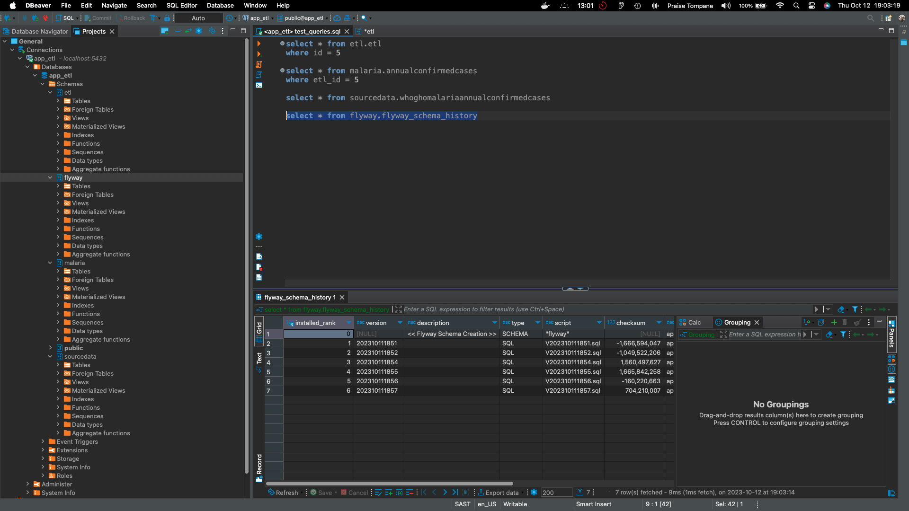
- Terminal output subsequent runs: <br>
    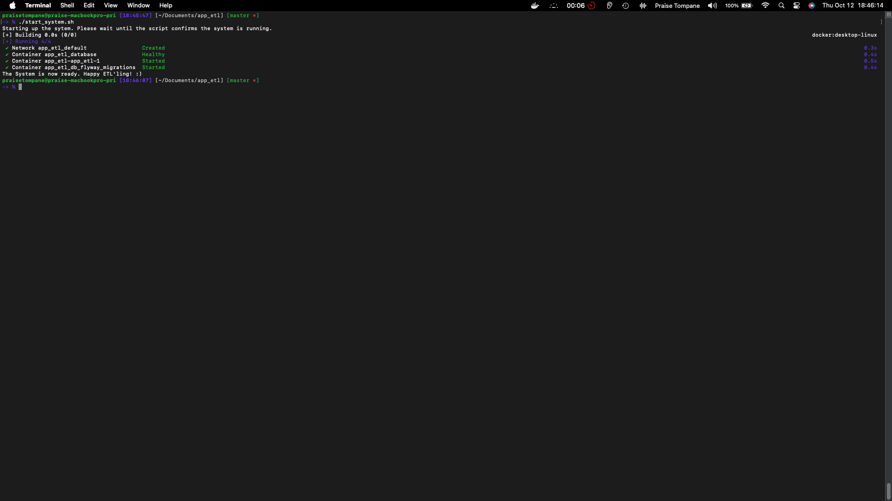
- Docker state:
    - containers:
    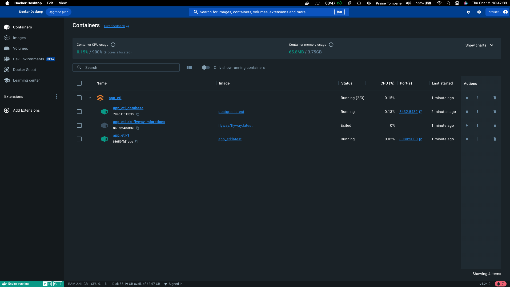
    - iamges:
    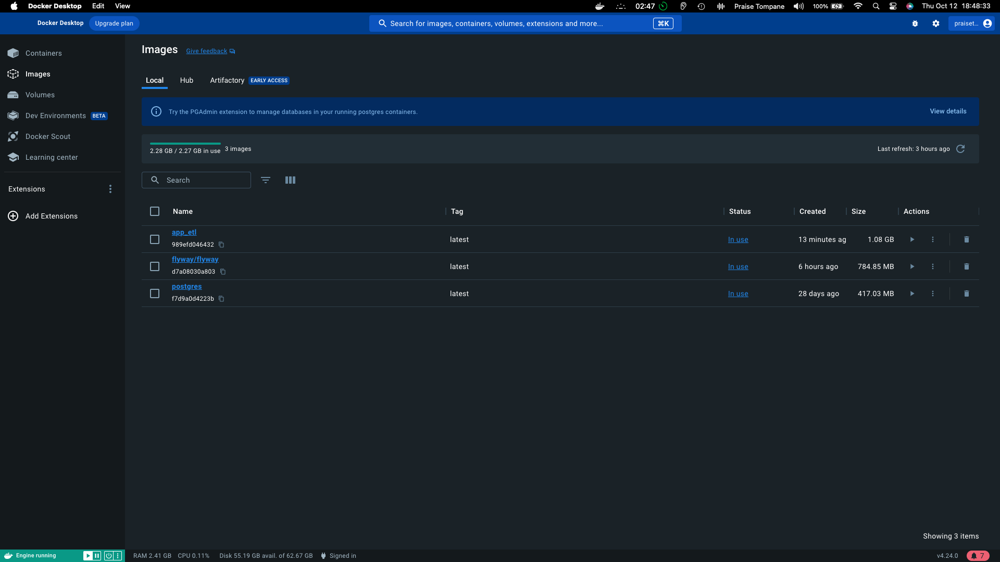

### 2. initiate an ETL:
- The curl request used can be found in the `curl_post_start_etl.sh` file in the `utilities` folder. <br>
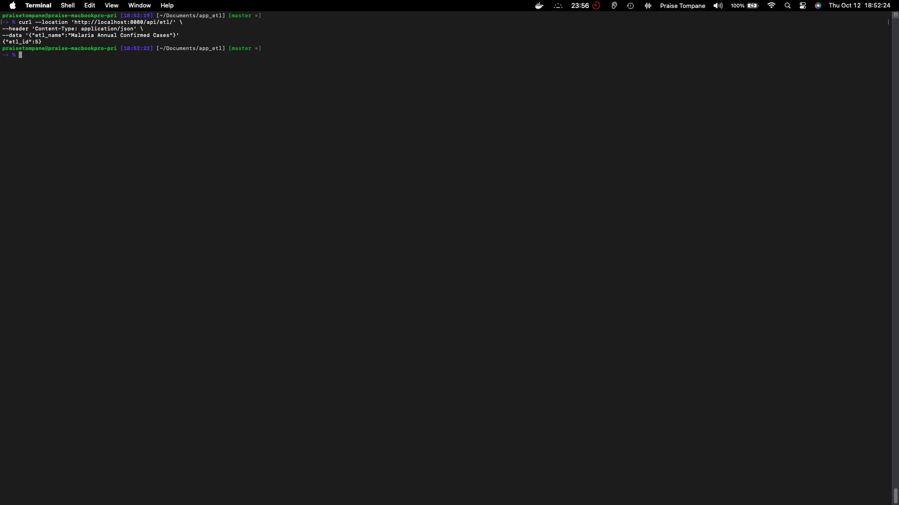
- If you prefer Postman, the requests collection is in the `app_etl.postman_collection.json`  file in the `utilities` folder.


### 3. app_etl_database state after ETL:
- The database script to view the tables can be found in the `test_queries.sql` file in the `utilities` folder. <br>
    - ETL table:
        - table: etl.etl
        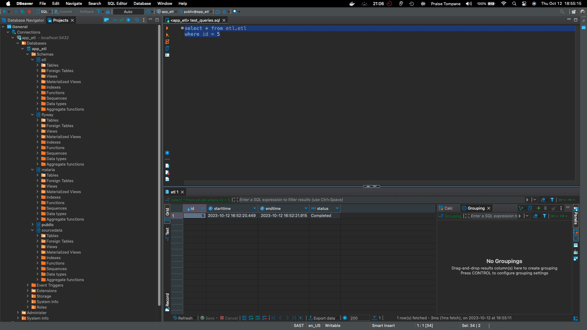
    - Source Data table:
        - table: sourcedata.whoghomalariaannualconfirmedcases
        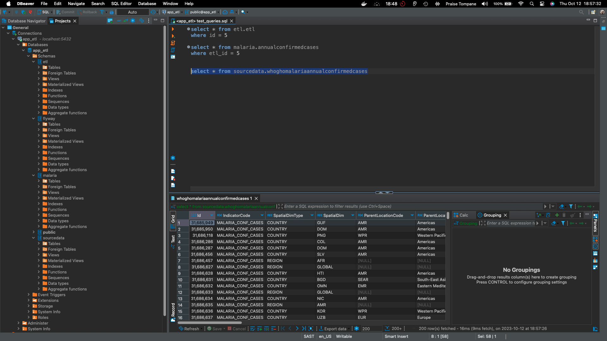
    - Target table:
        - table: malaria.annualconfirmedcases
        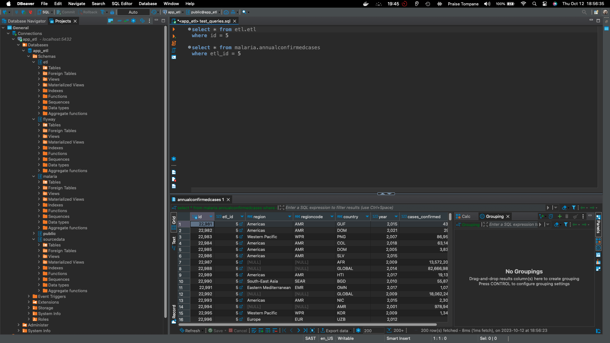

### 4. stop system output:<br>
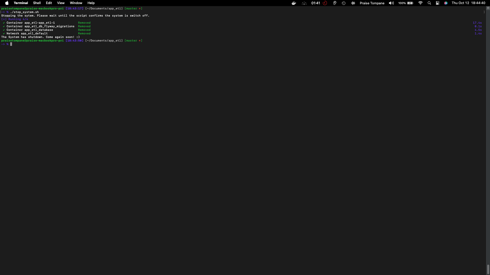

**Disclaimer**: This is still work in progress.
